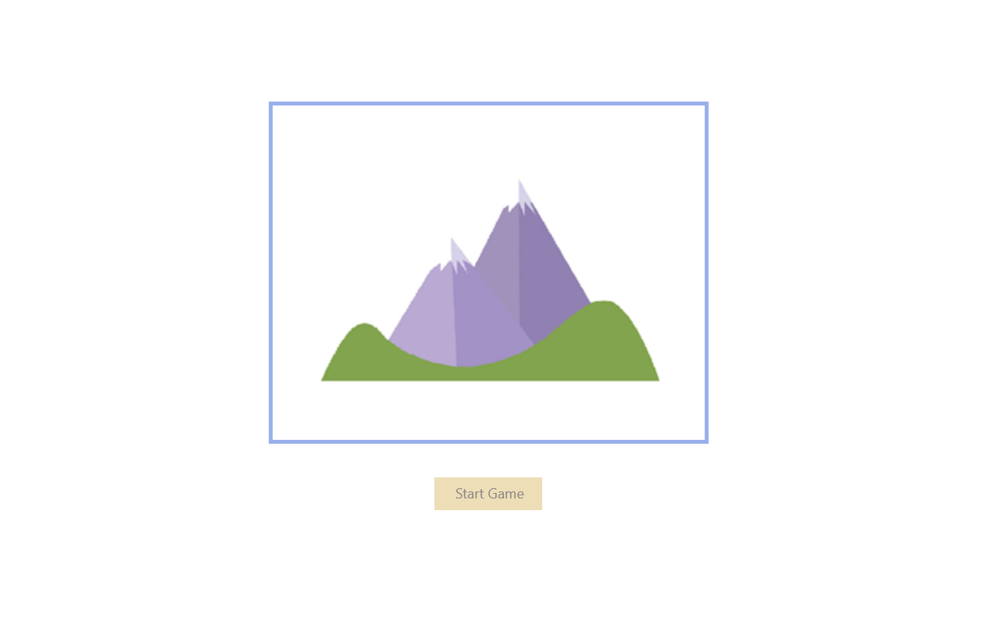
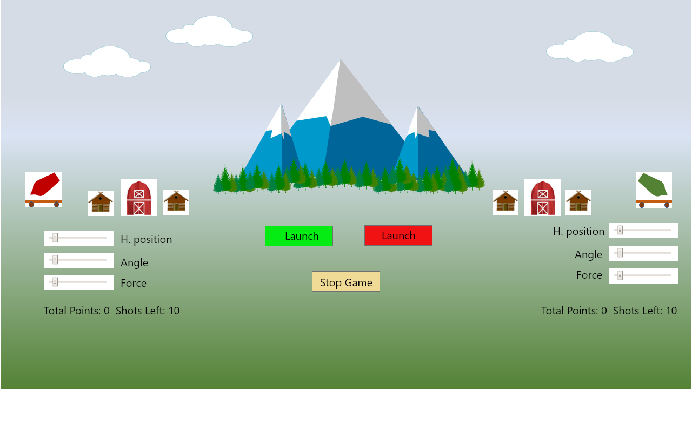
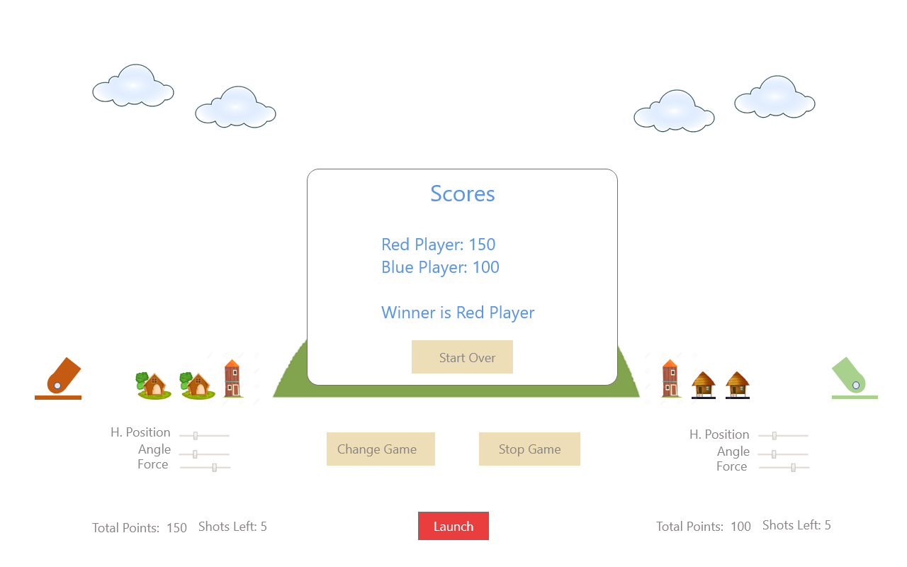

# (Project1Game)

## *****NOTE This game require a web server to run. Simply openning the index.html file does not pull in all resources.*****

# Wireframe

# 
# The storyline: A new way has emerged to deliver goods, while maintaining minimum human contact.
#                Two major grocers in neighboring towns are racing to reach their customers 
#                using the new technology.
# 
#                 As the General Manager of your store, your goal is to deliver to your 
#                 customers, while trying to jam your opponent's launcher with groceries.
#
# Game instructinos
# ==================
# Goal of the game
#	Launch a projectile to hit target object. The target object may be behind an obstable.
#   Hitting your opponents target will increase score for your opponent, but not yours.
#   
# Players:
#	There are 2 players are allowed. Red player on left. Green player on right.
#	Each player has a launcher, which he can use to launcher a projectile. 
#   Each player has a limited number of projectiles (groceries) 
#	Either red player of green player can start first.
#	Player decides among themselves who is Red player, and who is Green player.
#   There is infinite headroom. Projectiles (groceries) may fly beyond the screen, 
#      they will come back due to gravity. 
# 
# To play game
#	Aim the launcher using the following slide controls:
#		Horizontal position
#		Angle
#		Force (NOTE: groceries would not lauch if Force is zero)
#
# To Win game. There are 2 ways
#   1) The opponent's launcher is hit.
#	2) Has the higher score when the game stops. See next paragraph for ways a game can stops
#	The score board will show up in a modal window and declare the winner.
#
# To Stop game. There are 2 ways
#	1) Click the Stop Game button.
#	2) All the projectiles have been used.
# 
# NOTE: This game require a web server to run. Simply openning the index.html file does not pull in all resources.

## Schedule (Objectives/Goals)
### Wednesday
1. Wireframe
2. Pseudo code/High leve design
### Thursday
1. JS coding
### Friday
1. JS coding
### Saturday
1. JS coding
2. 
### Sunday
1. HTML/CSS
### Monday
1. HTML/CS + JS

### Monday
1. Tweaks and advance HTML/CSS (animations)
