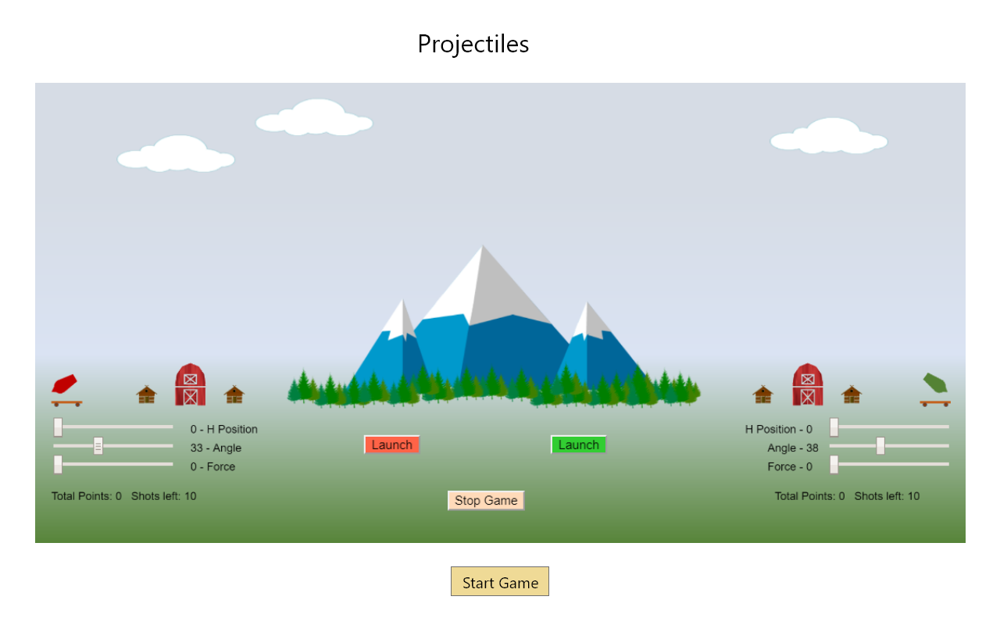
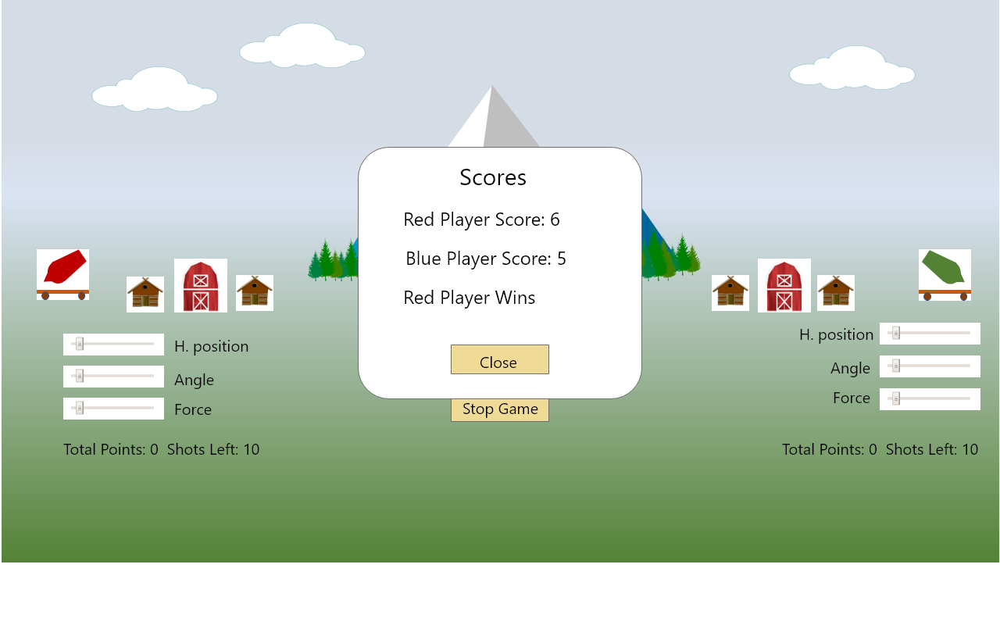

# (Project1Game)

# Wireframe

# Game instructinos
# Goal of the game
#	Launch a projectile to hit target object. The target object may be behind an obstable.
#
# Players:
#	There are 2 players are allowed. Red player on left. Green player on right.
#	Each player has a launcher, which he can use to launcher a projectile. Each player has a limited number of projectiles. 
#	Red player always start first. The takes alternate turns afterwards.
#	Player decides among themselves who is Red player, and who is Green player.
#
# To start game
#	Select one of the 2 games by clicking on the game and click Start Game button.
#
# To play game
#	Aim the launcher using the following slide controls:
#		Horizontal position
#		Angle
#		Force
#
# To Win game. There are 2 ways
#   1) The opponent's launcher is hit.
#	2) Has the higher score when the game stops. See next paragraph for ways a game can stops
#	The score board will show up in a modal window and declare the winner.
#
# To Stop game. There are 2 ways
#	1) Click the Stop Game or Change Game button.
#	2) All the projectiles have been used.

## Schedule (Objectives/Goals)
### Wednesday
1. Wireframe
2. Pseudo code/High leve design
### Thursday
1. JS coding
### Friday
1. JS coding
### Saturday
1. JS coding
2. 
### Sunday
1. HTML/CSS
### Monday
1. HTML/CS + JS

### Monday
1. Tweaks and advance HTML/CSS (animations)
